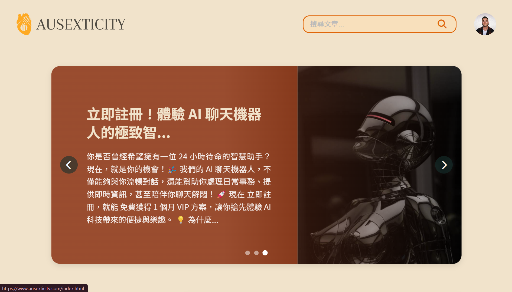

# Ausexticity

## 專案簡介
Ausexticity 是一個現代化的性知識文章分享、交流平台，整合了 AI 對話功能。專案採用前後端分離架構，並盡可能提供高效能的使用者體驗和直覺的操作介面。

## 功能展示

| 頁面 | 功能說明 | 預覽圖 |
|------|---------|--------|
| 首頁 | 文章瀏覽、AI 對話入口 |  |
| 聊天機器人 | AI 智慧對話系統 |  |
| 文章管理 | 文章編輯與管理介面 |  |
| 發文系統 | 支援圖片上傳與標籤 |  |
| 文章閱讀 | 響應式閱讀體驗 |  |
| 搜尋功能 | 智慧標籤搜尋 |  |
| 後台管理 | 使用者與內容管理 |  |

## 技術架構

### 後端技術
- **主要框架**：FastAPI (Python 3.8+)
- **身份驗證**：Firebase Authentication
- **資料儲存**：
  - Firestore (NoSQL 資料庫)
  - Firebase Storage (圖片儲存)
- **AI 服務**：
  - Anthropic Claude 3.5 API (對話系統)
  - Google Cloud Platform
    - BigQuery (資料分析)
    - Vertex AI (機器學習)
    - Translation API (多語言支援)
- **伺服器**：Uvicorn (ASGI)

### 前端技術
- **核心技術**：
  - HTML5
  - CSS3 (純 CSS，模組化架構)
  - JavaScript (ES6+，原生實現)
- **第三方整合**：
  - Firebase SDK
  - Cloudflare Turnstile (人機驗證)
- **特色**：
  - 響應式設計
  - 模組化 CSS
  - 無框架依賴

## API 端點文檔

### 使用者相關
```
POST /login                 - 使用者登入
POST /signup               - 使用者註冊
GET  /user/role            - 獲取使用者角色
POST /user/role            - 更新使用者角色
GET  /user/avatar          - 獲取使用者頭像
POST /user/avatar          - 更新使用者頭像
```

### 文章相關
```
GET    /articles           - 獲取文章列表
POST   /articles           - 發布新文章
PUT    /articles/{id}      - 更新文章
DELETE /articles/{id}      - 刪除文章
POST   /upload_image       - 上傳圖片
DELETE /delete_image       - 刪除圖片
```

### AI 對話相關
```
GET  /chat                 - 獲取 AI 回應（SSE）
POST /chat/history         - 儲存對話記錄
GET  /chat/history         - 獲取對話記錄
DELETE /chat/history       - 刪除對話記錄
```

## 部署指南

### 後端部署 (Render)
1. 在 Render 建立新的 Web Service
2. 連結 GitHub 儲存庫
3. 設定環境變數：
   ```
   ENVIRONMENT=production
   CLOUDFLARE_SECRET_KEY=your_key
   GOOGLE_CREDENTIALS=your_credentials
   OPENROUTER_API_KEY=your_key
   ```
4. 設定啟動命令：
   ```bash
   uvicorn main:app --host 0.0.0.0 --port $PORT
   ```

### 前端部署 (Firebase Hosting)
+ 需設定 Firebase authentication 、 storage 、 firestore
+ 並部屬至靜態網頁託管平台

### 域名設定
1. 在 Cloudflare 設定 DNS 記錄
2. 設定 SSL/TLS 加密
3. 配置自訂域名：ausexticity.com

## 本地開發設置

### 後端設置
```bash
# 1. 安裝依賴
cd backend
pip install -r requirements.txt

# 2. 設定環境變數
cp .env.example .env
# 編輯 .env 文件

# 3. 啟動開發伺服器
uvicorn main:app --reload
```

### 前端設置
```bash
# 使用 Python 簡易伺服器
cd frontend
python -m http.server 5500

# 或使用 VS Code Live Server
```

## 專案結構
```
Ausexticity/
├── backend/
│   ├── main.py              # FastAPI 主程式
│   ├── ai_module.py         # AI 功能模組
│   ├── requirements.txt     # 依賴清單
│   └── .env                 # 環境變數
├── frontend/
│   ├── css/
│   ├── js/
│   ├── images/
│   └── *.html
└── README.md
```

## 授權
本專案採用 MIT 授權條款
